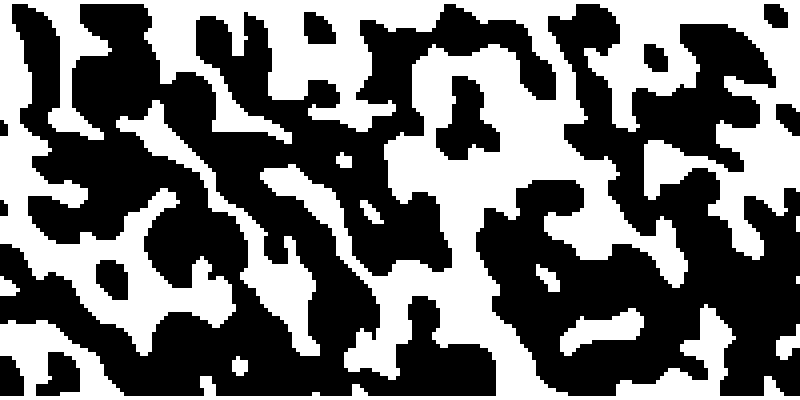
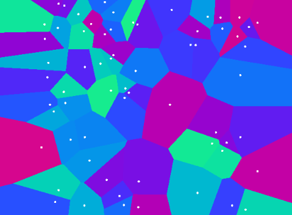
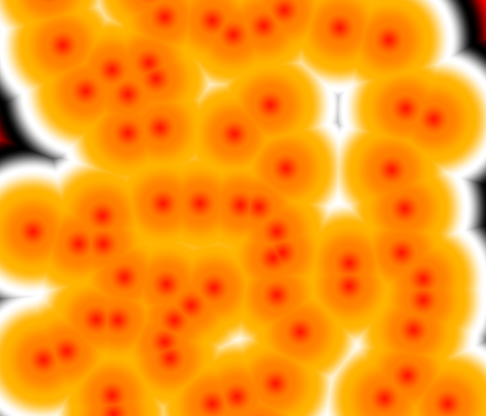
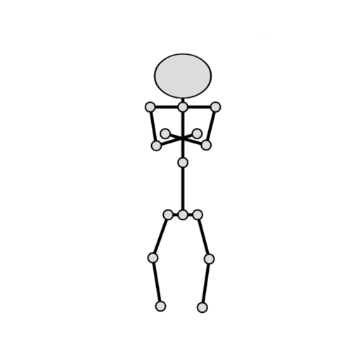
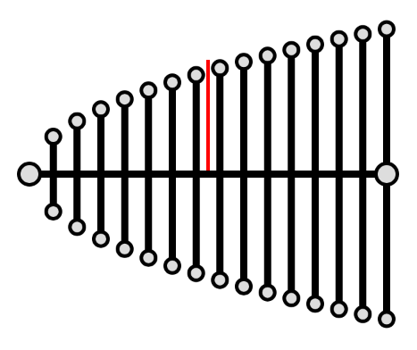
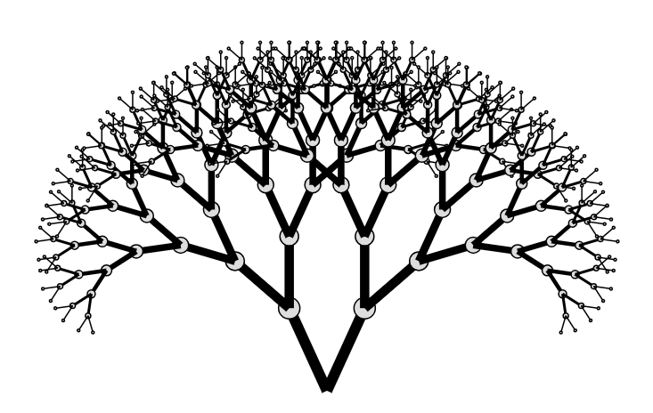
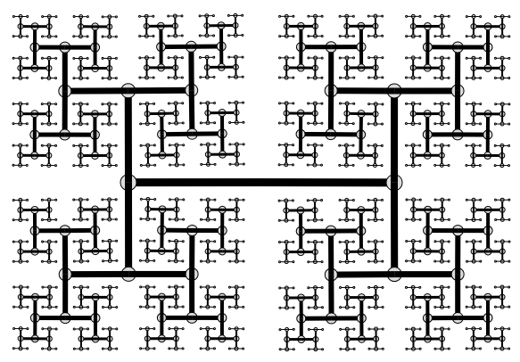
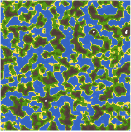

# Algorithmic world building

This repository contains various proof-of-concepts for different types of algorithms that are useful for world building.

 * [Game of life](https://darkeclipz.github.io/algorithmic-world-building/game-of-life.html)
 * [Voronoi](https://www.shadertoy.com/view/Xlccz2)
 * [Skeleton](https://darkeclipz.github.io/algorithmic-world-building/skeleton.html)
 * [Joint interpolation](https://darkeclipz.github.io/algorithmic-world-building/joint-interpolation.html)
 * [Trees](https://darkeclipz.github.io/algorithmic-world-building/trees.html)
 * Procedural landmass generation

## Math used

Most of the math used to build this library is:

 * Vector Geometry
 * Probability Theory
 * Trigonometry
 * Basic algebra; know your functions

## Pseudo random number generator

We want a seed based pseudo random number generator. The main reason for this is, we want predictive random numbers e.g.: if we start at a given seed, it should always generate the same sequence of random numbers. This property can be used to regenerate the same entity. 

For example, when a map is generated we only save the seed that is used to generate that map. Next, when we restart the algorithm with that seed, we will get the same result. This allows us to discard any generated data, and reconstruct it when it is required.

**Implementation**

A JavaScript implementation for the generator is:

```javascript
let seed = 0;
let random = function() {
    let x = Math.sin(seed++ * 4871452.47) * 87175.89;
    return x - Math.floor(x);
};
```

Because this is a simple generator, **do not use this for _cryptographic_ purposes**!!

## Game of Life

Game of life is a cellular automation algorithm developed by John Conway. Normally the algorithm implements a rule where cells can die if there are too many cells around it. If we ignore this rule, the result is an algorithm that will grow/expand. 



**Why this works**

The cool thing about this algorithm is that it will cluster cells on each generation. If there are lonely cells, they will die because there are not enough cells around. Because of this property the algorithm will generate a maze/cave like structure.

**Smoothing**

It is also possible to smooth a pixel space with this. At any given generation, we generate a new generation where the number of alive cells required is 2. This will grow the structure that is in the pixel space. After that we want to cut it, by setting the number of alive cells to 7. We then run another generation, which will cut off a portion of the structure. The result acts like a smoothing effect, and the smoothing can be done in multiple successions to create a smoother structure.

## Voronoi

In mathematics, a Voronoi diagram is a partitioning of a plane into regions based on distance to points in a specific subset of the plane. That set of points (called seeds, sites, or generators) is specified beforehand, and for each seed there is a corresponding region consisting of all points closer to that seed than to any other. These regions are called Voronoi cells. [[Wikipedia](https://en.wikipedia.org/wiki/Voronoi_diagram)] An [article from 
Nick Berry](https://datagenetics.com/blog/may12017/index.html) explains it really well.

The brute-force method is particularly easy to run in parallel on a GPU. Generate a set of random points, and find the point that has the smallest distance from the pixel to the point. To display it, give each point a specific color to display at that pixel.



The [implementation of the algorithm](https://www.shadertoy.com/view/Xlccz2) can be viewed live at ShaderToy. There is also a [smooth colored version](https://www.shadertoy.com/view/ltcyRj).



Besides pretty images, Nick Berry explains a few very cool use cases:

> If your job was to build a nuclear waste storage depot and a crieterion was that it had to be as far away as possible from any city, you can see how it must be located on a Voronoi edge. Maybe you have to fly your spy plane across a country and want to select a path that is the furthest distance away from every radar station to minimize the chance that you are detected. A maximally clear path will follow the lines edges of a Voronoi tessellation. Do you need to traverse a battlefield keeping a maximal distance for a group of snipers?

## Skeleton

The following example gives the idea of a skeleton. It has 30 adjustable parameters!



An approach for the face would be to map point from a 2D plane onto a 3D face. Then apply any rotation to the face, and get the points back to 2D space to draw them properly.

## Joint interpolation

To draw the characters, we need points. With a provided skeleton, we can generate the point by interpolating between the joints. Based on different curves, we can shape the body to our likings. Finally, all the points should be connected, and draw a quadratic bezier between each point.



This is easier than you might think, look at the following pseudo-code:

```javascript
P = new Vec2(0,0);
Q = new Vec2(100,0);

int N = 10;

for(int i=0; i <= N; i++) {

    float alpha = i / N; // Value between [0, 1], based on which iteration
                       // we are in the loop.

    Vec2 R =  (1-alpha) * P  + alpha * Q; // Point between P and Q based on alpha.

    drawPoint(R);   
}
```

We can get the normal vector (red line in the illustration), and normalize it so it has unit length. Then at each interpolated point we get the top point with `R + normal` and the bottom point with `R - normal`. We can then create a function `f` that has `alpha` as input, and gives a value between [0, 1]. If we calculate `(R + normal) * f(alpha)` this results in the top points distance following a curve, given by `f`.

## Trees 

Trees are relatively easy to draw if we do this with recursion. In the simplest case, we start with a root node. Then we call the recursive function for the root node. The recursive functions requires an angle, and the current depth, as well as a max depth as a global parameter. In the recursive step, we find the two points, and add the rotation to them. Then we call the recursive step, and add our new angle to the previous (to preserve all the rotations), and the parent node (to preserve the translation). 



The following pseudo-code should give an idea for the recursive function:

```javascript
let branch = function(angle, depth, parent) {

    if(depth >= maxDepth) return;

    let alpha = depth / maxDepth;

    let scale = new Vec2(1,1).scale(branchLength * Math.pow((1-branchDamping), depth));
    let L = new Vec2(0,1).rotate(angle + branchAngle).vmult(scale).add(parent);
    let R = new Vec2(0,1).rotate(angle - branchAngle).vmult(scale).add(parent);

    // Draw both branches:
    // 1. parent to L
    // 2. parent to R

    branch(angle + branchAngle, depth+1, L);
    branch(angle - branchAngle, depth+1, R);
    
}
```

To add a more natural look, we can change the length of the branches by adding a certain standard deviation multiplied by a probability function. And if we apply just the right conditions, we get the points for a Hilbert curve.

 

## Procedural landmass generation

### Perlin noise

 

### Color map

 

### Mesh

 

## Todo

 - Perlin noise
 - Simplex noise
 - Flood fill area (for tilemaps)
 - Distance map (for tilemaps)
 - Probability density functions
 - Biomes